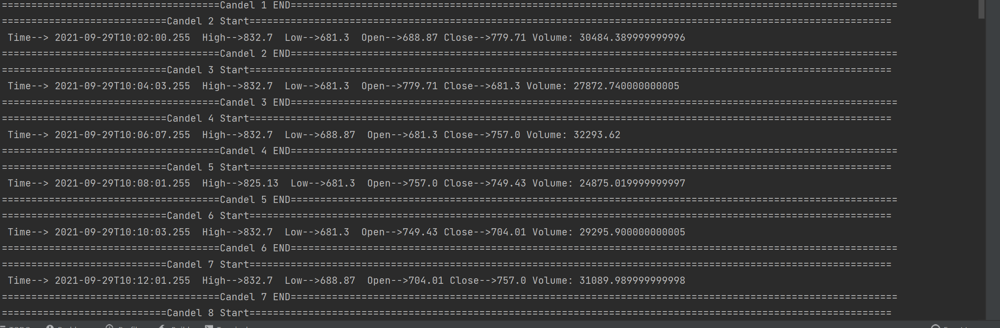

## CandelSeries
Task:

1. Generate fake candle series data.

generate list of CandleSeriesData

public class CandleSeriesData {
private LocalDateTime time;
private String symbol; (USD, KES) currency type
private double price;
}

2. Create a method to generate candles.
   /**
    * Return the trades made in a certain period represented as candles based on the granularity.
    *
    * @param symbol      The name of the symbol
    * @param startDate   The start date (utc)
    * @param endDate     The end date (utc)
    * @param granularity The granularity in seconds
      */

   public List<CandleDTO> getCandles(String symbol, LocalDateTime startDate, LocalDateTime endDate, int granularity) {

}

Return CandleDTO

    public class CandleDTO {
    long time; //timestamp in millisecond
    double low; // min price
    double high; // max price
    double open; // first price
    double close; //last price
    double volume; //total txn amount
}

3. Closing price on one must be the opening price of the following candle.
4. Candle must be calculated on each granularity.

Note: no need to implement frontend, just generate List<CandleDTO>

#OUTPUT

