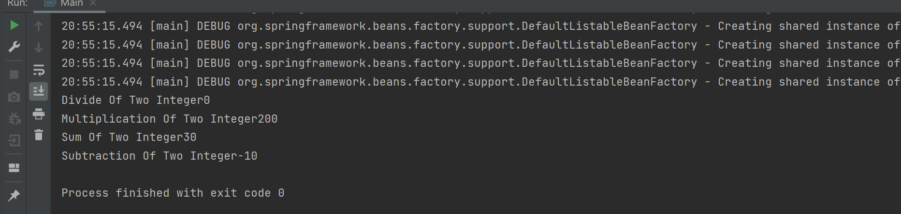

# Spring Boot Assignment-2

####Task1
Create class call Calculator inside it add some method or use switch case( add, sub, multiple and divide) accepting two integer parameter so that it can calculate

Create Bean of the class by annotation(i.e @Bean) in Configuration file(i.e config.class) which is also annotating with (@Configuration)

Create a main class and initialize Application context and then get that register bean
Print the result by invoking the appropriate method

###Output:

Create Student class and  annotate with Component
Create Configuration class and use Component Scan Annotation with base package

Print the hashcode(i.e object representation) by calling same bean twice in main class and if the
Object is same print object are same

Again change the scope of component annotated class to prototype then just like above call bean twice and if object does not match print object are not same

####Task 2
Create class Student and Address
Add a method in student to print name and id
Add a method in address to print name and id
Inject address to student by Autowiring and call the address method in student method

Entry this in config class by using java configuration (i.e) bean or annotation configuration(component)  as you like

Print the student name and address

###Output:

#####Task 3 

Create class Student and Address
Add a method in student to print name and id
Add a method in address to print name and id
Inject address to student by Autowiring and call the address method in student method

Entry this in config class by using java configuration (i.e) bean or annotation configuration(component)  as you like

Print the student name and address

#####Task4

Continue with task 3

Create an interface call Programming with method programming and implement it in Java Programming

Inject dependency i.e (Programming) in Student class and call the method implementing in Java Programming

Create another class Java Script Programming implementing Programming and call the method programming

Note : In this task use @Qualifier to select the components(i.e java , java script)

#####Task5

Continue with task 4

Fetch the value entry in application properties(if not created, create in resource folder ) by using

@Value in string literal created in the student class as company

Print the value in the console

Additional task: Also use @Required in that string literal to validate the value exists in your properties file

####OUTPUT

