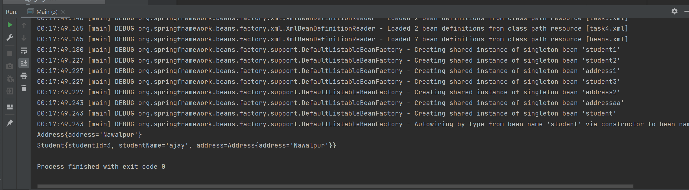

# Spring Boot Assignment-1

###Concepts for how beans are mange and initialize in Spring containe

####Task1
Create a classes Student with property (id,name) and generate the getter and setters as well
Create a bean of this class in config file i.e (beans.xml)so that we don't need to create object to initialize
Create a Main class for execution and use Application Context to retrieve e bean object

Additional task : set the value of the property in config file and print in console in object string

###Output:

###Related to Dependency Injection

####Task 2
Setter Injection

Create a classes Student and Address with same properties like above where Student is dependent upon address and also create setter method for setter injection

Create a bean of this classes  in config file i.e (beans.xml) and also put a reference of child i.e (Address) in parent bean Student

Initialize the properties of classes in bean.xml and print the properties in console  in object string

###Output:

#####Task 3
###Constructor Injection

Same as setter injection in task 2 but icreate an constructor in student where argument should be the dependent object

####OUTPUT

####Task 4
###Autowired Injection

Same Scenario in task 2 and 3 but need to configure the dependency in autowire mode

As we have discussed the type of autowire i.e

byName
byType
constructor

Switch on to each types and initialized properties in config file (bean.xml) and print the object in string format

###OUTPUT

